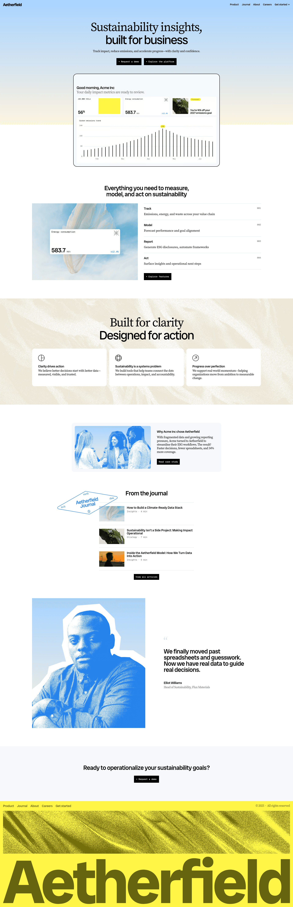

# DESIGN.md: Aetherfield (Figma Sites template)

## Source
- URL: https://need-spiny-01266573.figma.site/
- Capture date: 2026-08-12
- Evidence: Firecrawl `branding` + `images` scrape (`.firecrawl/aetherfield-branding.json`), full-page screenshot 1920×5932 (`.firecrawl/aetherfield-screenshot.png`), page markdown (`.firecrawl/aetherfield.md`), raw HTML measurements (`.firecrawl/aetherfield.html`)
- Note: this is Figma's own "Modern, Clean SaaS Company" template, published as a Figma Site. Its copy, photography, logo and wordmark belong to Figma/the template author — **structure and layout are what we are borrowing, not assets or copy.**

## Reference Screenshot


Use this screenshot as the visual source of truth for layout, hierarchy, density, and feel. Tokens below describe the same page in machine-readable form.

## Design Summary

A quiet, editorial SaaS landing page. Its character comes from **layout discipline, not decoration**: one narrow centred column (~1030px) running the full page, huge display type against small body text, hairline-ruled list rows where most sites would use card grids, and small unobtrusive pill buttons. Rhythm comes from **full-bleed background bands** that alternate white → textured beige → white → pale grey → yellow, so the page reads as chapters rather than a scroll of equal blocks.

Two signature moves worth stealing:
1. **Split-font stacked headlines** — line 1 in a serif, line 2 in a sans, same size, centred. Used for the hero and again for the values band.
2. **Numbered hairline list rows** (`001`–`004`) instead of a feature card grid — the number sits right-aligned at the row's end.

Everything else is restraint: 500 is the heaviest weight on the page, buttons are small, colour is used in exactly three places (hero gradient, duotone photos, yellow footer).

## Design Tokens

### Colors

Observed from scrape. This is the *reference's* palette — see "Applying to Naymly" for the mapping we actually use.

| Role | Value | Where |
|---|---|---|
| Page background | `#FFFFFF` | default section band |
| Text primary | `#000000` | headings, body |
| Text muted | `rgb(108,108,108)` → `#6C6C6C` | meta, captions, subheads |
| Surface tint | `#F6F8FB` | case-study card, closing-CTA band |
| Band — beige | textured image fill (~`#E8E2D6` inferred) | values section, full-bleed |
| Accent — yellow | `#FFF546` | footer band |
| Accent — olive | `#66640F` | giant footer wordmark on yellow |
| Accent — blue | `#2D6CFF` (inferred from duotone) | photo duotone treatment only |
| Hero gradient | sky blue → warm cream, vertical | hero band |
| Button fill | `#000000`, text `#FFFFFF` | all CTAs |
| Border/hairline | `rgba(0,0,0,0.08)` (inferred) | list-row rules, card borders |

Colour is deliberately scarce — the whole page is black-on-white plus one gradient, one duotone, one yellow footer.

### Typography

| | Family (observed) | Notes |
|---|---|---|
| Display serif | Radio Canada Display / Source Serif Pro | headline line 1 only |
| Sans | ui-sans-serif system stack | headline line 2, all body/UI |
| Mono | Geist Mono | button labels, meta rows, `001`–`004` numbers |

Scale (observed `font-size` values, px):

| Token | Size | Weight | Line height | Tracking |
|---|---|---|---|---|
| Display / h1 | `80` (mobile ~`40`) | 400–500 | `1.0` | `-4px` (−0.05em) |
| Section heading | `40` | 500 | `1.2` | `-1.2px` |
| Card / row title | `20–24` | 500 | `1.2` | `-0.4px` |
| Body | `18–20` | 400 | `1.2–1.5` | `-0.4px` |
| Meta / label | `14` | 500 | `1.0` | `-0.08px` |
| Footer wordmark | `288` | 500 | `1.0` | `-3.2px` |

Rules:
- **Only two weights on the page: 400 and 500.** Nothing bolder. This is most of why it reads expensive.
- Negative tracking scales with size — roughly `-0.05em` on display, `-0.03em` on headings, `-0.02em` on body.
- Display line height is a flat `1.0`; two-line headlines sit tight on top of each other.
- Mono is reserved for *labels and numbers*, never for prose.

### Spacing And Layout

```
Base unit          4px
Outer wrapper      max-width 1500px
Content container  max-width 1030px  (narrow variants: 980 / 760 / 620)
Side padding       20px  (all breakpoints)
Radius             8 / 12 / 16 / 20 / 24px   (24 = hero product frame, 12 = cards)
Breakpoints        600px (mobile) · 800px · 1280px
```

Section vertical rhythm (observed padding values):

| Use | Padding Y |
|---|---|
| Major section | `120px` |
| Standard section | `80px` |
| Compact band | `40px` |
| In-section stack | `24px` |

Gaps: `16px` (tightest, icon↔text), `24px` (card grid), `32px`, `40px` (column split), `56px` (heading↔content).

**The container never widens.** Full-bleed backgrounds extend edge-to-edge, but their content stays in the same 1030px column as everything else. That consistency is the layout.

## Components

**Nav** — sticky, transparent over the hero. Grid: wordmark left · links right · `Get started →` pill far right. Links `14px`/500. Height ~64px. No centre band.

**Button (pill)** — small, black fill, white `14px` mono label, radius `20px` (fully rounded), padding roughly `10px 16px`. Primary labels carry a leading `·`. Secondary = same size, outlined or ghost. **Deliberately undersized** relative to the display type.

**Product frame** — hero screenshot in a `24px`-radius container with a `1px` border and subtle shadow, positioned to straddle the boundary between the hero gradient band and the white band below it.

**Numbered list row** — `grid-cols-[1fr_auto]`. Left: title (`20px`/500) over description (`16px` muted). Right: `001` in mono `14px` muted. `1px` bottom hairline, `24px` vertical padding. Four rows stacked, last rule optional.

**Value card** — white, radius `12px`, hairline border, `24px` padding. Icon (`24px` line-art SVG) → `20px` gap → title (`20px`/500) → `8px` → body (`16px` muted). Three across on desktop, `24px` gap; stacks below 800px.

**Split card** — two columns inside one tinted `#F6F8FB` container: image left (~40%), text right, `40px` gap. Used for the case study.

**Journal row** — thumbnail (~`88×64`, radius `8px`) · title (`18px`/500) · meta line (`Category · 4 min`, mono `14px` muted). Hairline separated, three stacked.

**Testimonial** — two columns, `40px` gap. Full-bleed duotone portrait left (~45%). Right: quote glyph, quote at `32px`/400 with `1.2` line height, then name (`16px`/500) + role (`14px` muted).

**Footer** — yellow band. Row one: links left, `© 2025 · All rights reserved` right, `14px`. Below: textured strip, then the wordmark at `288px` cropped off the bottom edge of the page.

## Page Patterns

Section order and background band, top to bottom:

| # | Section | Band | Layout |
|---|---|---|---|
| 1 | Nav | transparent | 3-col grid |
| 2 | Hero | blue→cream gradient | centred column; split-font headline, subhead, 2 pills |
| 3 | Product shot | straddles gradient/white | single framed image, centred |
| 4 | Features | white | centred heading, then 2-col: image ~45% / numbered rows ~55% |
| 5 | Values | full-bleed textured beige | centred split-font heading + 3-card row |
| 6 | Case study | white | narrow tinted card, image left / text right |
| 7 | Journal | white | left heading + decorative badge, 3 hairline rows, centred pill |
| 8 | Testimonial | white | duotone portrait left / quote right |
| 9 | Closing CTA | pale grey `#F6F8FB` | centred one-line heading + single pill |
| 10 | Footer | yellow `#FFF546` | link row, texture, oversized cropped wordmark |

Responsive: below `800px` every two-column split stacks to one; below `600px` display type drops from `80px` to roughly `40px` and side padding stays `20px`. Nav links collapse to a menu toggle.

Interaction is minimal — colour/opacity hover transitions on links and buttons, no parallax, and a `prefers-reduced-motion: reduce` block is present.

## Content Style

- Headlines are **two-part declaratives** split across the serif/sans lines: "Sustainability insights, / built for business" · "Built for clarity / Designed for action".
- Subheads are one sentence, em-dash pivot, ending on a benefit: "…accelerate progress—with clarity and confidence."
- Feature rows are **one verb + one line**: `Track` → "Emissions, energy, and waste across your value chain". No paragraphs.
- CTAs are lowercase-ish sentence case and specific: "Request a demo", "Explore the platform", "Read case study", "View all articles". Never "Learn more".
- Numbers do the persuading ("34% more coverage"), not adjectives.

## Applying to Naymly

Naymly already shares the reference's bones — narrow container (`1100px` vs `1030px`), sticky transparent nav, warm neutral ramp, `001/002/003` numbering in `how-it-works.tsx`. What it is missing is the **band rhythm** and the **type contrast**.

Token mapping — keep Naymly's warm palette, borrow the structure:

| Reference | Naymly equivalent |
|---|---|
| `#FFFFFF` page | `--color-neutral-50` `#F6F5F2` |
| `#000000` text | `--color-neutral-900` `#0F0D0A` |
| `#6C6C6C` muted | `--color-neutral-500` `#6C6862` |
| `#F6F8FB` tint band | `--color-neutral-100` `#EDEBE7` |
| beige textured band | `--color-gold-100` `#F7EED4` or neutral-100 |
| `#FFF546` footer | `--color-brand-600` `#2E50A9` (already the closing-CTA colour) |
| blue duotone photos | `--color-brand-500` `#4167C9` duotone |
| black pill button | `--color-primary` `#0F0D0A` — already correct |

Section mapping onto the existing page:

| Reference section | Naymly component |
|---|---|
| Hero + product frame | `hero.tsx` + `hero-product-frame.tsx` — the map, framed and cropped by the fold |
| Features (numbered rows) | `how-it-works.tsx` — **convert the 3-card carousel to hairline rows**, keep `001/002/003` |
| Values (3 cards, tinted band) | `gap.tsx` (`#why`) — already a tinted band with a centred heading; it is one long paragraph where the reference is three short cards |
| Case study / split card | optional; could hold a single testimonial |
| Journal rows | skip — no blog yet |
| Testimonial | optional |
| *(reference has no equivalent)* | the old `#places` map section — removed, absorbed into the hero frame |
| Closing CTA | `closing-cta.tsx` — already matches, just narrow the band |
| Footer wordmark | `footer.tsx` — add the oversized cropped `Naymly` wordmark |

Concrete changes, highest impact first:
1. **Rebuild the type scale.** Display to `1.0` leading and `-0.05em` tracking, cap weights at 500 (Naymly currently uses `font-bold`/`font-extrabold`), add a mono face for labels and the `001` numbers.
2. **Replace the feature carousel with numbered hairline rows** in a 2-column split.
3. **Standardize the band rhythm.** Every section on one padding scale (`120px` major / `80px` compact) and one `1100px` container, with adjacent sections never sharing a background.
4. **Shrink the buttons.** Pill radius, `14px` mono label, small padding.
5. **Framed product shot in the hero, cropped by the fold.** Done — `hero-product-frame.tsx`. The map moved out of its own section into this frame, so the one screen that shows what the product produces is now on the fold instead of two folds down. It renders a pre-captured static image (`public/hero-map.png`) and swaps to the live MapLibre map once the visitor scrolls past the crop, which keeps ~250KB of map JS off the fold.
6. *(not done — full-restructure scope)* Duotone photography, oversized cropped footer wordmark.

Naymly already carries a distinct gradient background on most sections (`dreamy-pastel-wash`, `soft-pastel-blend`, the hero constellation). Those **are** its bands — the reference's alternation is reproduced by keeping them and giving the sections between them a flat tint, not by replacing them with flat colour.

## Agent Build Instructions

Building a new page in this style:

1. Wrap every section in a full-bleed `<section>` carrying its own background; put a `mx-auto max-w-[1030px] px-5` container inside. Never widen the container per-section.
2. Alternate section backgrounds so no two adjacent sections share one. Vertical padding is `120px` for hero/major, `80px` standard, `40px` compact.
3. Set display headings at `clamp(40px, 6vw, 80px)`, `line-height: 1`, `letter-spacing: -0.05em`, weight 400–500. Split across two lines with different families if a serif is available.
4. Body copy `18px`, muted grey, `max-width: 620px`, centred under centred headings.
5. Use mono at `14px` for every label, button, meta row and ordinal. Prose is never mono.
6. Feature lists are hairline rows (`border-b`, `24px` padding-y, title + one-line description left, ordinal right), not card grids.
7. Buttons: fully-rounded, dark fill, `14px` mono, `10px 16px` padding. Keep them small.
8. Cap font weight at 500 everywhere.
9. Photography gets a single-hue duotone so images read as brand surface rather than stock.
10. Close with a tinted CTA band and a footer whose wordmark is cropped by the page edge.

## Rerun Inputs
```
workflow: firecrawl-website-design-clone
source_url: https://need-spiny-01266573.figma.site/
target_stack: Next.js 15 App Router + Tailwind v4 (@theme tokens in app/tokens.css)
output: docs/DESIGN.md
```
